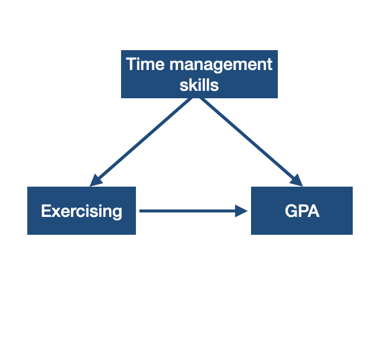

class: title-slide


<br>
<br>
.pull-right[ 

# `r rmarkdown::metadata$title`
## `r rmarkdown::metadata$author`
]

---


## Anecdotal Evidence

You know two left-handed artists, you conclude being left-handed makes someone be better in art.

We tend to remember unusual cases.

We need rigorously designed studies to make generalizations and to establish causal relationships.

---

class: center middle

Do UCI students who exercise regularly have higher GPA?


---


## Observational Study

- There is no treatment/intervention.
- Causal relationships should not be made.

Even if we observe that UCI students who exercise regularly have higher GPA, we cannot conclude that exercising regularly increases GPA.

---

## Relationship between two variables

If two variables are related to each other in some way we would call them __associated__.

If two variables are not related to each other in any way we would call them __independent__.

---

## Relationship between two variables

When we examine the relationship between two variables, we often want to know if the relationship between them is causal. In other words, does one variable cause the other? For instance, is exercising the reason for higher GPA? We don't know!

When we suspect that two variables have a causal relationship we can say

The __explanatory variable__ (e.g. exercising) might causally affect the __response variable__ (e.g. GPA).

--

Relationship between two variables does not imply one causes the other. 


---

## Relationship between two variables

Explanatory variables are denoted by $x$ and the response variable is denoted by $y$. You can remember this from e**X**planatory variable is $x$. Exercising may e**X**plain high GPA. 

---

```{r echo = FALSE, fig.align='center', out.width='50%'}

```

--

A __confounding variable__ (e.g. time management skills) has a correlation with the the explanatory and the response variable.

---

class: center middle


~~Do UCI students who exercise regularly have higher GPA?~~

Does exercising regularly increase GPA for UCI students?


---

## Practice

What is the explanatory variable?  
What is the response variable?

---
## Experiment Design

```{r echo=FALSE, out.width='80%', fig.align='center'}
knitr::include_graphics('img/experiment.png')
```

.footnote[Image Copyright Derenik Haghverdian. Used with permission.]


---

class: center middle

In __experiments__, researchers assign cases to treatments/interventions.

---

class: center middle

In __randomized experiments__, researchers randomly assign cases  to treatments/interventions. In order to establish causal link between variables, we need randomized experiments. 

---

## Blocking

A doctor has developed a drug called drug `i.d.s.` to treat some disease. She wants to know if patients who take drug `i.d.s.` is free of the disease for at least a year.

--

Plot twist: The doctor suspects that the drug may affect adults and kids differently.

--

If researchers suspect that the an additional variable that may influence the response variable then they may use __blocks__.

---

## Blocking


```{r echo=FALSE, out.width='80%', fig.align='center'}
knitr::include_graphics('img/blocking.png')
```

.footnote[Image Copyright Federica Ricci. Used with permission.]


---

### A/B testing 

- A/B testing is a randomized experiment that compares two versions (A and B) of a single variable. 

- It is commonly used on measuring online activities such as revenue per user, click through rates for online ads, number of returning users.

--

```{r echo = FALSE, fig.align='center', out.width='50%'}
knitr::include_graphics("img/ab_testing.png")
```

---

class: inverse middle

.font75[More vocabulary about experiments]


---

class: center middle

A __placebo__ is a fake treatment. If a patient shows an improvement by taking a placebo then this is called a __placebo effect__.

---

class: center middle

In __blind__ studies, patients do not know what treatment they receive. In __double blind__ studies patients who receive and the doctors who provide the treatment do not know the type of the treatment. 

---

class: center middle

[Institutional Review Board](https://research.uci.edu/compliance/human-research-protections/index.html)

---

## Random Sampling vs. Random Assignment

- Random sampling is used to select the sample from the population randomly. Random sampling allows for findings to be generalized to the population.

- Random assignment is used to put participants to treatment/intervention groups randomly in experiments. Random assignment allows us to make causal relationships.

